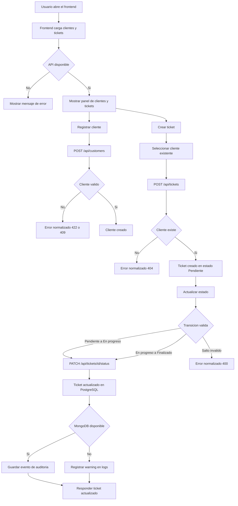

# Flujo de la aplicacion

Este diagrama resume el flujo principal para gestionar clientes y tickets de soporte.

```mermaid
flowchart TD
  A[Usuario abre el frontend] --> B[Frontend carga clientes y tickets]
  B --> C{API disponible}
  C -- No --> D[Mostrar mensaje de error]
  C -- Si --> E[Mostrar panel de clientes y tickets]

  E --> F[Registrar cliente]
  F --> G[POST /api/customers]
  G --> H{Cliente valido}
  H -- No --> I[Error normalizado 422 o 409]
  H -- Si --> J[Cliente creado]

  E --> K[Crear ticket]
  K --> L[Seleccionar cliente existente]
  L --> M[POST /api/tickets]
  M --> N{Cliente existe}
  N -- No --> O[Error normalizado 404]
  N -- Si --> P[Ticket creado en estado Pendiente]

  P --> Q[Actualizar estado]
  Q --> R{Transicion valida}
  R -- Pendiente a En progreso --> S[PATCH /api/tickets/id/status]
  R -- En progreso a Finalizado --> S
  R -- Salto invalido --> T[Error normalizado 400]
  S --> U[Ticket actualizado en PostgreSQL]
  U --> V{MongoDB disponible}
  V -- Si --> W[Guardar evento de auditoria]
  V -- No --> X[Registrar warning en logs]
  W --> Y[Responder ticket actualizado]
  X --> Y
```
