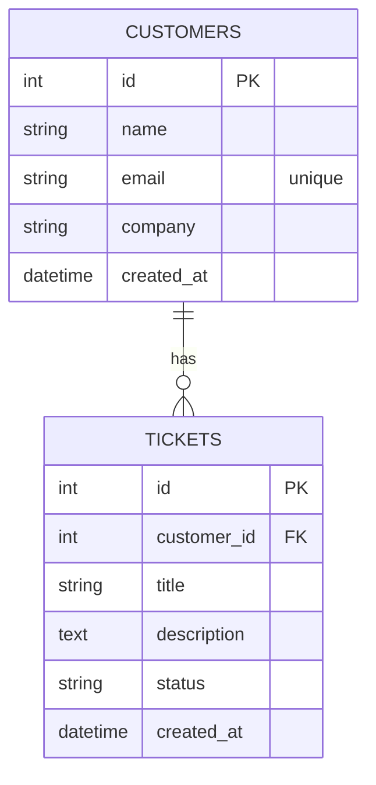

# Modelo de datos

```mermaid
erDiagram
  CUSTOMERS ||--o{ TICKETS : "has"

  CUSTOMERS {
    int id PK
    string name
    string email "unique"
    string company
    datetime created_at
  }

  TICKETS {
    int id PK
    int customer_id FK
    string title
    text description
    string status
    datetime created_at
  }
```
