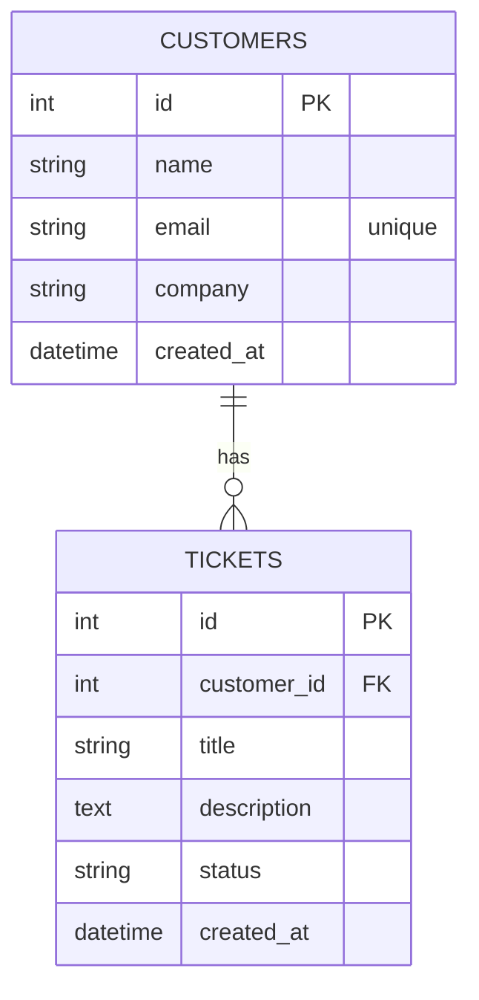

# Modelo de datos

PostgreSQL mantiene las entidades principales de la aplicacion.



## Auditoria MongoDB

MongoDB se usa como almacenamiento opcional de eventos de auditoria. No reemplaza a PostgreSQL ni participa en las relaciones principales.

Coleccion:

```text
imagine_support_audit.ticket_events
```

Documento ejemplo:

```json
{
  "ticket_id": 1,
  "customer_id": 1,
  "action": "ticket.status_changed",
  "previous_status": "Pendiente",
  "new_status": "En progreso",
  "user": "system",
  "occurred_at": "2026-07-09T21:45:00Z"
}
```
